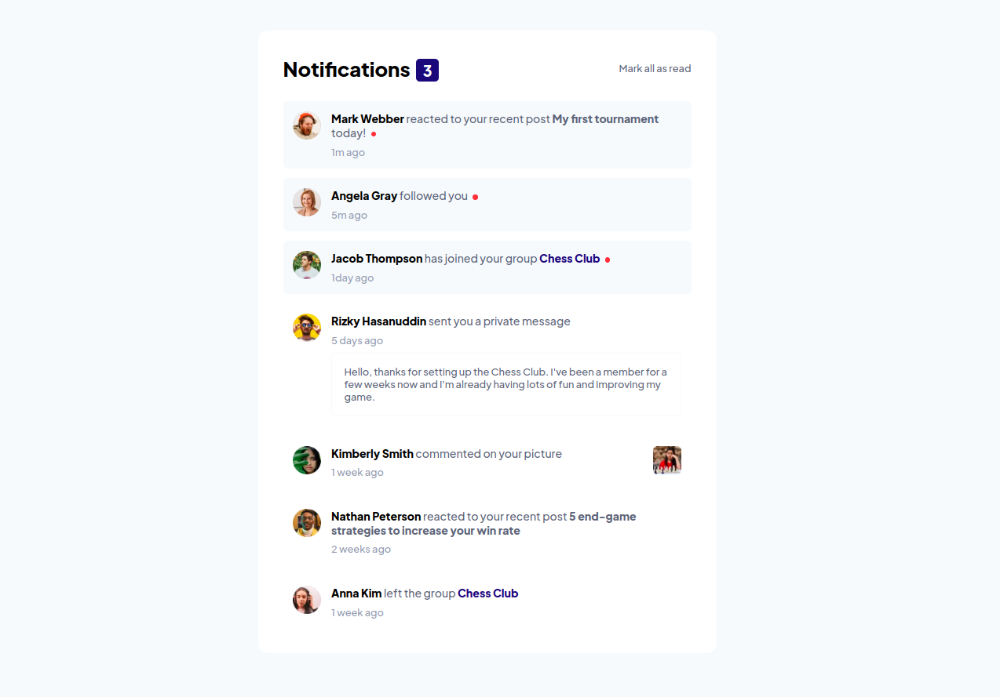
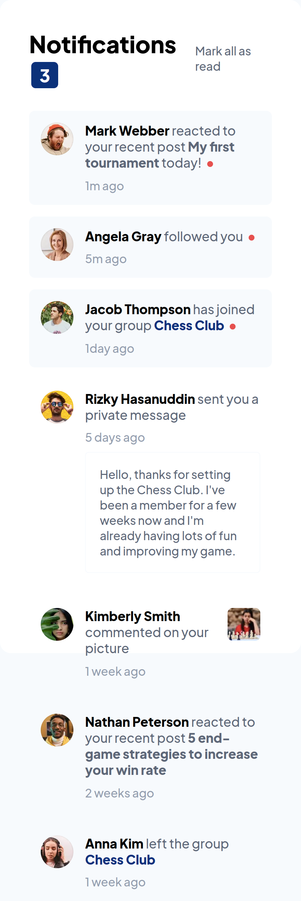

# Frontend Mentor - Notifications page solution

This is a solution to the [Notifications page challenge on Frontend Mentor](https://www.frontendmentor.io/challenges/notifications-page-DqK5QAmKbC). Frontend Mentor challenges help you improve your coding skills by building realistic projects. 

## Table of contents

  - [The challenge](#the-challenge)
  - [Screenshot](#screenshot)
  - [Links](#links)
  - [My process](#my-process)
  - [Built with](#built-with)
  - [Author](#author)

### The challenge

Users should be able to:

- Distinguish between "unread" and "read" notifications
- Select "Mark all as read" to toggle the visual state of the unread notifications and set the number of unread messages to zero
- View the optimal layout for the interface depending on their device's screen size
- See hover and focus states for all interactive elements on the page

### Screenshot

### Links

- Solution URL: [Add solution URL here](https://your-solution-url.com)
- Live Site URL: [Add live site URL here](https://www.frontendmentor.io/profile/dudleydelgado)

## My process

The first thing was to analyze the project to know how the component would be structured semantically. After this, start applying the corresponding styles and at the end add the necessary javascript for the correct operation.

I think the difficulty of this component is to make an organized and reusable html

### Built with

- Semantic HTML5 markup
- CSS custom properties
- Flexbox
- CSS Grid
- Mobile-first workflow

## Author

- Website - [Dudley Delgado](https://dudleydelgado.github.io/portfolio/)
- Frontend Mentor - [@dudleydelgado](https://www.frontendmentor.io/profile/dudleydelgado)
- Twitter - [@dudley.code](https://www.instagram.com/dudley.code)

